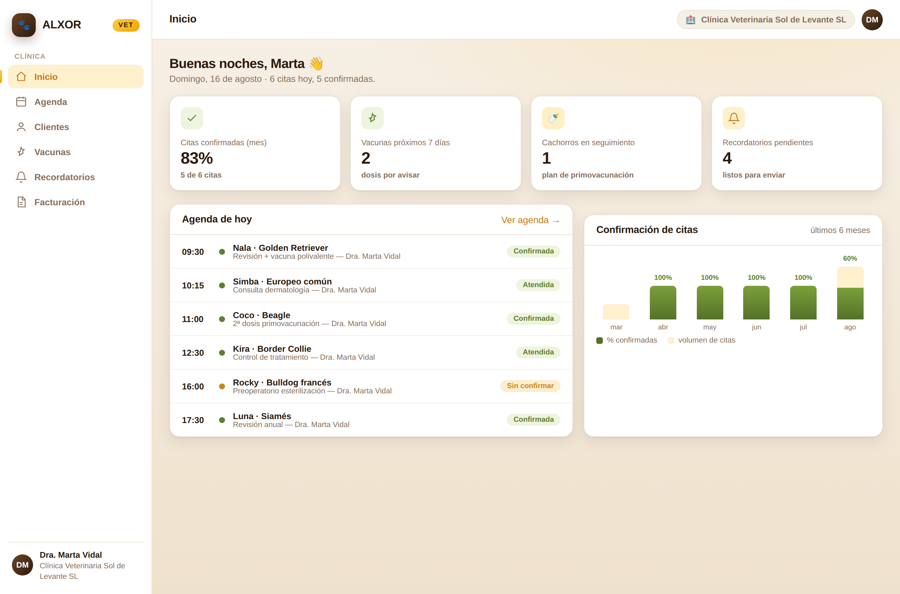
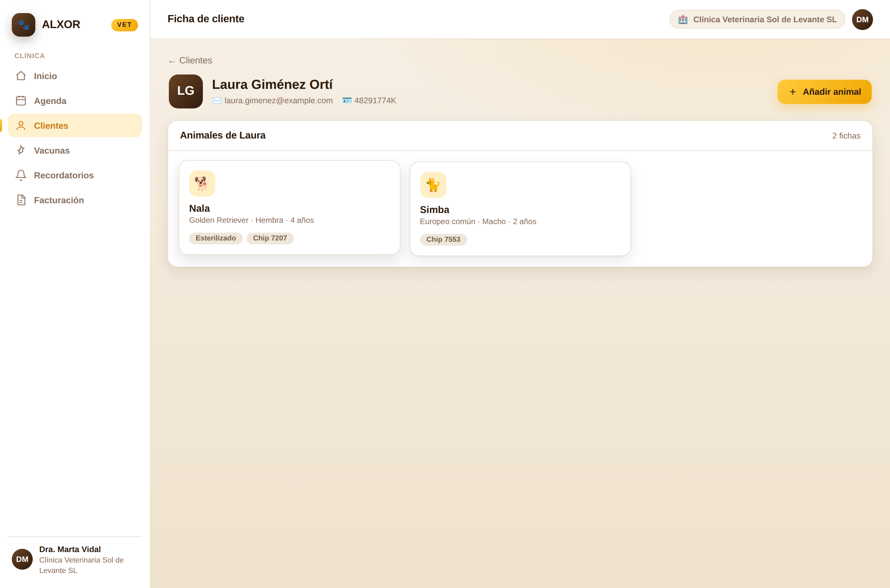
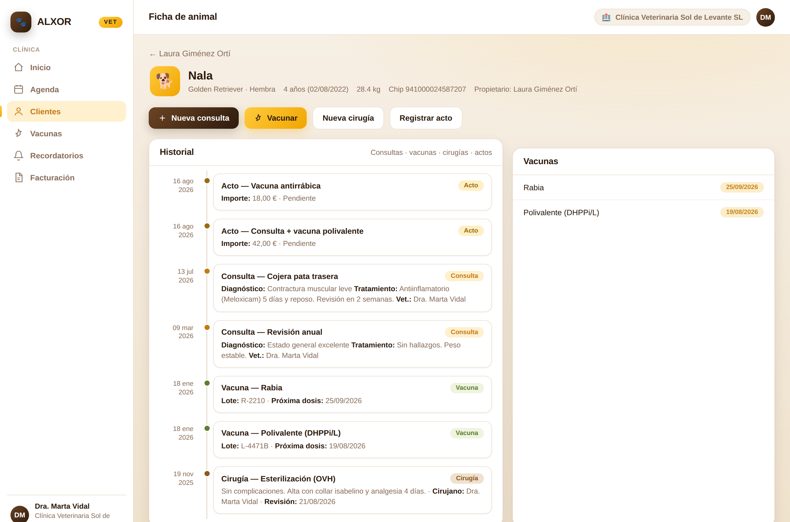
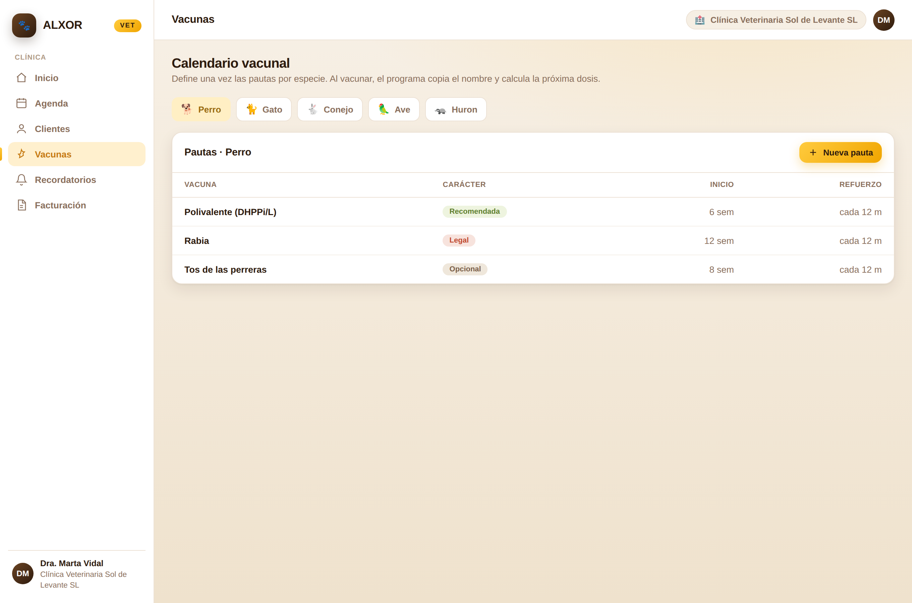
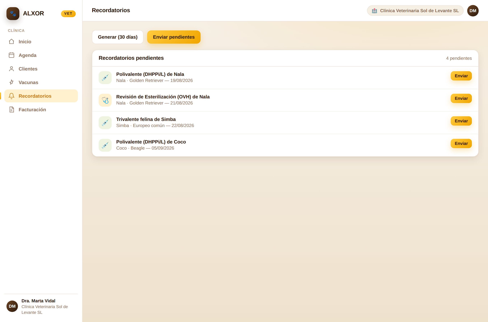
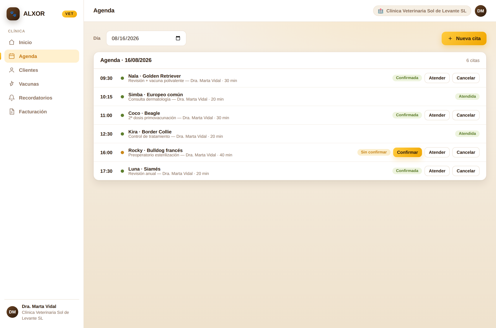
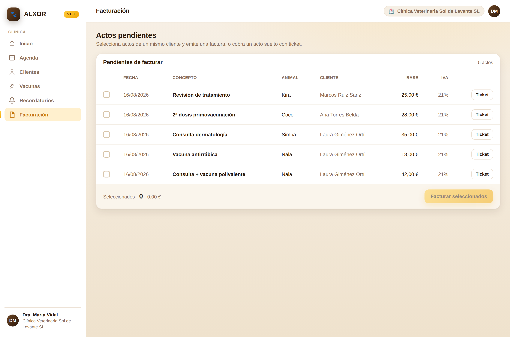
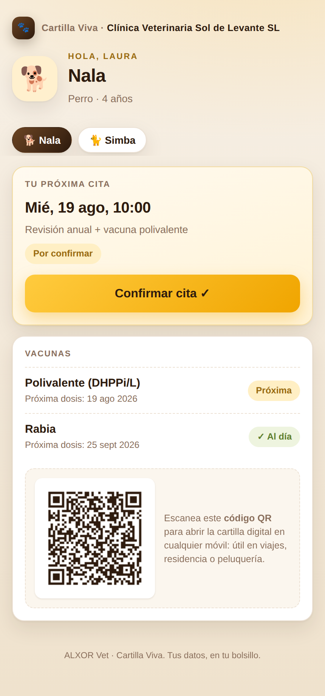
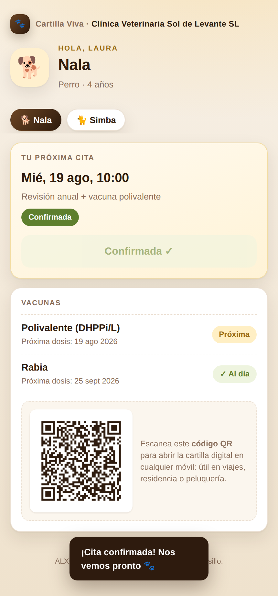

# Guía de demostración — ALXOR Vet

Guion práctico para enseñar **ALXOR Vet** a una clínica veterinaria. Incluye cómo arrancar la
aplicación con datos de demo, el guion paso a paso (qué clicar y qué contar en cada pantalla) y unas
notas honestas sobre qué es demostración y qué queda para fase 2.

> Producto: gestión veterinaria (agenda, historial, vacunas, recordatorios y facturación de actos)
> con **Cartilla Viva**, el portal del dueño de la mascota. Corre sobre ALXOR Core (.NET 8 +
> PostgreSQL).

---

## 1. Cómo arrancar (5 minutos)

Necesitas **PostgreSQL** en `localhost:5432` (usuario/contraseña `postgres`) y la **API** de ALXOR
arrancada. En *Development* la API aplica sus migraciones sola al arrancar.

### Paso a paso

1. **PostgreSQL**. Con Docker: `docker compose up -d`. O un PostgreSQL propio en el 5432.

2. **API** en `http://localhost:8080`:

   ```bash
   dotnet run --project src/AlxorCore.Api
   ```

   (Si no tienes el SDK instalado, este repo se ha ejecutado con el SDK vía Docker; ver `CLAUDE.md`.)
   Comprobación de vida: `GET http://localhost:8080/salud`.

3. **Datos de demo** (siembra la clínica «Sol de Levante» completa):

   ```bash
   python3 scripts/datos-demo-vet.py http://localhost:8080
   ```

   El script es **idempotente**: no duplica si ya hay animales. Al terminar imprime el **enlace de la
   Cartilla Viva** con su token; cópialo, lo necesitarás en el último paso del guion.

   > Consejo para una demo fresca: si quieres que todas las fechas (citas de hoy, próximas dosis)
   > queden ancladas al día de la demo, resiembra desde cero antes de empezar:
   > `psql -h localhost -U postgres -c "DROP DATABASE IF EXISTS alxor WITH (FORCE); CREATE DATABASE alxor;"`,
   > reinicia la API (vuelve a migrar) y ejecuta de nuevo el sembrado.

### Credenciales y URLs

| Qué | Valor |
|---|---|
| SPA de la clínica | `http://localhost:8080/vet.html` |
| Usuario | `demo-vet@alxorcore.es` |
| Contraseña | `Demo1234!` |
| Cartilla Viva (móvil, sin login) | `http://localhost:8080/cartilla.html?token=…` *(el token lo imprime el seed)* |

La clínica de demo es **Clínica Veterinaria Sol de Levante SL** y la usuaria, **Dra. Marta Vidal**.
Hay 4 clientes, 6 animales (incluido el cachorro **Coco**), historiales con consultas/vacunas/cirugía,
citas de hoy (varias confirmadas para que luzca el KPI), próximas citas, recordatorios y actos por
facturar.

---

## 2. Guion de demostración paso a paso

Orden pensado para **vender**: empieza por el valor visible (KPI y agenda), recorre la historia
clínica, y cierra con el diferencial emocional (la Cartilla Viva en el móvil del dueño). En cada punto
se indica **qué requisito del cliente cubre**.

### Paso 0 — Entrar
Abre `http://localhost:8080/vet.html`. El correo ya viene puesto; escribe `Demo1234!` y **Entrar**.
> *«Una sola pantalla, en español, sin manual. En cinco minutos una clínica está operando.»*

### Paso 1 — Panel de inicio y **KPI de citas confirmadas**
Se ve el saludo con el nombre de la doctora, cuatro KPIs y dos paneles (agenda de hoy + gráfico de
confirmación de los últimos 6 meses).
- Señala el KPI grande **«Citas confirmadas (mes)»** (p. ej. **83 %**, «5 de 6 citas»).
- Señala el gráfico **Confirmación de citas**: barras con el % confirmado mes a mes.

> **Cubre:** reducir el absentismo. *«El número que más duele en una clínica son los huecos que no
> avisan. Aquí lo tienes medido, y más abajo verás cómo lo subimos: con recordatorios y con la
> Cartilla, el dueño confirma de un toque.»*



### Paso 2 — Cliente con varios animales
Menú **Clientes** → abre **Laura Giménez Ortí**. Tiene dos animales: **Nala** (Golden Retriever) y
**Simba** (gato europeo).
> **Cubre:** ficha del propietario y su «familia» de mascotas de un vistazo, con chips de esterilizado
> y microchip. *«Un cliente, todos sus animales.»*



### Paso 3 — Ficha de animal e **historial unificado**
Entra en **Nala**. Muestra el **Historial**: en una sola línea de tiempo aparecen **consultas,
vacunas, cirugías y actos** ordenados por fecha, y a la derecha el resumen de **Vacunas** con su
próxima dosis.
- Recorre un evento de cada tipo: la **cirugía** (esterilización con revisión), una **consulta** con
  diagnóstico y tratamiento, una **vacuna** con lote y próxima dosis.
- Enseña los botones de acción: **Nueva consulta**, **Vacunar**, **Nueva cirugía**, **Registrar acto**.

> **Cubre:** historia clínica completa sin saltar entre módulos. *«Todo lo que le ha pasado al animal,
> en un scroll.»*



### Paso 4 — **Vacunas**: cuadro maestro por especie
Menú **Vacunas**. Cambia de pestaña **Perro / Gato / …**. Cada especie tiene sus **pautas** con
carácter (**Legal** / Recomendada / Opcional), edad de inicio y periodicidad de refuerzo.
> **Cubre:** calendario vacunal estandarizado. *«Se define una vez por especie; al vacunar, el
> programa copia el nombre y calcula solo la próxima dosis.»*



### Paso 5 — **Recordatorio** de vacuna + **correo** al cliente
Menú **Recordatorios**. Pulsa **Generar (30 días)**: el sistema crea avisos a partir de los
vencimientos de vacunas y revisiones. Elige uno (p. ej. *Polivalente de Nala*) y pulsa **Enviar**.
> **Cubre:** fidelización y relleno de agenda proactivo. *«El sistema sabe a quién le toca y se lo
> recuerda por correo. Menos vacunas olvidadas, más visitas.»*
> *(En la demo el envío de correo es un stub — ver Notas.)*



### Paso 6 — Agenda y **confirmar cita**
Menú **Agenda** (día de hoy). Verás las citas con su estado por color. Busca la que está **«Sin
confirmar»** y pulsa **Confirmar** (también puedes **Atender**, **Cancelar** o crear una **Nueva
cita**).
> **Cubre:** gestión del día. *«El equipo trabaja el día desde aquí; cada acción da feedback
> inmediato.»*



### Paso 7 — **Facturar** un acto (VeriFactu) o cobrarlo con ticket
Menú **Facturación**. Están los **actos pendientes**. Marca uno o varios **del mismo cliente** (p. ej.
los dos de Laura/Nala) y pulsa **Facturar seleccionados**: se emite una **factura** reutilizando el
motor de Facturación de ALXOR (numeración correlativa, IVA, **VeriFactu**). Alternativa: **Ticket**
para cobrar un acto suelto.
> **Cubre:** cerrar el círculo clínico→cobro sin reescribir nada. *«Lo que el veterinario registra
> como acto, recepción lo factura de un clic, con factura legal o ticket.»*



### Paso 8 — La **Cartilla Viva** en el móvil del dueño (el diferencial)
Abre en el móvil (o en una ventana estrecha) el enlace `cartilla.html?token=…` que imprimió el seed.
Es el portal de **Laura** (dueña de Nala), **sin contraseña**: solo el enlace.
- Muestra la **próxima cita** y pulsa **Confirmar cita** → cambia a **«Confirmada»** con un toque.
- Enseña el bloque de **Vacunas** con su estado (Al día / Próxima) y el **código QR** real (abre la
  cartilla en cualquier móvil: útil en viajes, residencia o peluquería).
- Si eliges un cachorro (Coco), aparece además el **plan de crecimiento** con hitos.

> **Cubre:** la confirmación de citas desde el lado del dueño (sube el KPI del Paso 1) y una imagen de
> marca moderna. *«Esto es lo que ve el cliente en su móvil. Confirma sin llamar, lleva la cartilla
> siempre encima. Cálido con el dueño, y a la vez alimenta el número de confirmación de la clínica.»*

 

### Cierre
Vuelve al **Panel** y recuerda el hilo: *recordatorio → Cartilla → confirmación → agenda llena →
acto → factura*. Todo en una herramienta, en español y sin manual.

---

## 3. Notas honestas (qué es demo, qué es fase 2)

- **Correo (recordatorios):** en la demo el SMTP no está configurado, así que el envío es un **stub**:
  la acción responde «enviado» y marca el recordatorio, pero **no sale un correo real**. En una
  instalación se configura `Correo:*` en `appsettings` (host, usuario, remitente) y se envía de verdad.
- **VeriFactu:** la facturación de actos reutiliza el módulo de Facturación de ALXOR Core, con
  numeración correlativa e IVA. La integración VeriFactu está implementada a nivel de emisión; el
  **envío a la AEAT en producción** requiere el certificado y el entorno reales del cliente.
- **Cartilla Viva:** el acceso es por **token** con aleatoriedad criptográfica (no hay contraseña). El
  token resuelve empresa y cliente y **fija el contexto multiempresa** en el servidor, de modo que el
  filtro por `empresa_id` (y la RLS) sigue aplicando. Un token inválido o revocado devuelve **404**.
- **Datos de demo:** son ficticios (clientes, NIF y correos de ejemplo). El seed ancla las fechas al
  día en que se ejecuta; resiémbralo el día de la demo para que «hoy» cuadre (ver arriba).

### Fallos conocidos / cosméticos

- **Formato del selector de fecha (Agenda):** el control nativo `<input type="date">` muestra la fecha
  según el **idioma del navegador** (en un Chrome en inglés se ve `MM/DD/YYYY`). En un navegador en
  español se ve `DD/MM/AAAA`. El título del panel y el resto de la app **siempre** muestran fechas en
  formato español `DD/MM/AAAA`. No es un error de la aplicación, sino del control del sistema.

Ningún error de consola en el recorrido completo (login → panel → clientes → ficha → animal → vacunas
→ recordatorios → agenda → facturación → cartilla).

---

## 4. Material de apoyo (carpeta `docs/veterinaria/`)

- **Maquetas** de las pantallas: [`maquetas-alxor-vet.html`](maquetas-alxor-vet.html)
- **Propuesta comercial**: [`propuesta-comercial.html`](propuesta-comercial.html)
- **Presentación** (8 páginas): [`presentacion-alxor-vet.pdf`](presentacion-alxor-vet.pdf)
- **Documento de validación / conformidad**: [`validacion-alxor-vet.pdf`](validacion-alxor-vet.pdf)
- **Capturas** de esta guía: carpeta [`demo/`](demo/)
